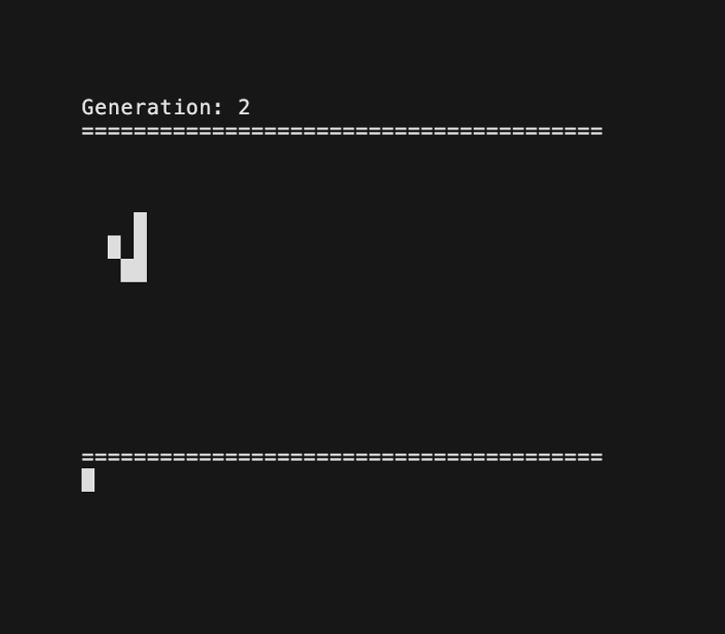

# 🧬 Conway's Game of Life in mq

An implementation of Conway's Game of Life cellular automaton written in [mq](https://github.com/harehare/mq), featuring animated visualization and a rich collection of classic patterns.



## Available Patterns

### Still Life Patterns (Static)

- **block** - Simple 2x2 square
- **beehive** - Hexagonal shape
- **loaf** - Bread loaf shape
- **boat** - Small boat shape
- **weekender** - Complex still life

### Oscillators (Periodic)

- **blinker** - Simple period-2 oscillator
- **toad** - Period-2 oscillator
- **beacon** - Period-2 oscillator
- **clock** - Beautiful period-2 oscillator
- **bi_clock** - Double clock oscillator
- **pulsar** - Period-3 oscillator
- **pentadecathlon** - Period-15 oscillator
- **penta_decathlon** - Alternative period-15 oscillator

### Spaceships (Moving Patterns)

- **simple_glider** - The famous glider
- **lwss** - Lightweight Spaceship
- **mwss** - Middleweight Spaceship
- **hwss** - Heavyweight Spaceship
- **copperhead** - Fast moving spaceship

### Complex Patterns

- **gosper_gun** - Glider gun that produces gliders
- **queen_bee_shuttle** - Complex pattern that creates gliders
- **die_hard** - Pattern that evolves for many generations before stabilizing
- **acorn** - Small pattern that creates complex evolving structures
- **r_pentomino** - Famous chaotic pattern (Methuselah)
- **eden1971** - Garden of Eden pattern
- **galaxy** - Beautiful spiral pattern
- **spaceship** - General spaceship pattern
- **schick_engine** - Puffer engine that leaves debris

## Usage

### Method 1: Using the Runner Script

```bash
# Make the script executable
chmod +x run.sh

# Run with default pattern (simple_glider) and generations (50)
./run.sh

# Run specific pattern with default generations
./run.sh gosper_gun

# Run specific pattern with custom generations
./run.sh r_pentomino 100

# See available patterns
./run.sh
```

### Method 2: Direct mq Execution

Edit the `game_of_life.mq` file and uncomment the desired pattern at the bottom:

```mq
# Uncomment one of these lines:
# | run_game_of_life(gosper_gun, 50);  # Gosper glider gun
# | run_game_of_life(r_pentomino, 100);  # R-pentomino chaos
| run_game_of_life(simple_glider, 30);  # Simple glider (active)
```

Then run:
```bash
mq game_of_life.mq
```

## Pattern Recommendations

- **Beginners**: Start with `simple_glider`, `blinker`, or `block`
- **Beautiful oscillators**: Try `pulsar`, `clock`, or `pentadecathlon`
- **Exciting spaceships**: Check out `lwss`, `mwss`, or `copperhead`
- **Complex evolution**: Run `r_pentomino`, `acorn`, or `die_hard` with high generation counts
- **Glider production**: Watch `gosper_gun` or `queen_bee_shuttle`

## Technical Implementation

The implementation features:

- **Efficient neighbor counting** with bounds checking
- **Functional programming approach** using [mq](https://github.com/harehare/mq)'s functional constructs
- **Immutable grid updates** for clean state transitions
- **Visual rendering** with Unicode block characters (█)
- **ANSI escape sequences** for screen clearing and positioning

## Requirements

- [mq](https://github.com/harehare/mq) programming language interpreter
- Terminal with ANSI escape sequence support
- Unix-like environment (for the shell script)

## Installation

### Installing mq

Before running the Game of Life, you need to install the mq programming language interpreter.

Please follow the installation guide at: https://mqlang.org/book/start/install

### Running the Game of Life

Once mq is installed, you can run the Game of Life:

## License

This project is licensed under the MIT License. See the [LICENSE](LICENSE) file for details.

---

*Enjoy exploring the fascinating world of Conway's Game of Life!*
